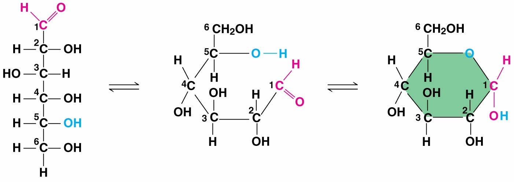

# **3** Carbon and the Molecular Diversity of Life {#carbon}
- **Organic compound:** a compound containing carbon-hydrogen bonds

## **3.1** Carbon
- Can form large, complex molecules by bonding to up to four other atoms <a class="footref">^&dagger;^</a><span class="footbody">There's some more ~~useless~~ chem discussed here, as well as in the unabridged textbook</span>

#### Carbon skeletons:
- Source of molecular diversity:
    - Vary in length and may be straight, branched, or arranged in rings
    - May have double bonds, which vary in number and location
    - Atoms of other elements can be bonded at available sites
- **Hydrocarbons:** organic molecules consisting of only carbon and hydrogen. Can undergo reactions that release a large amount of energy.

#### Chemical groups:
- Can replace one or more of the hydrogens bonded to the carbon skeleton of a hydrocarbon
- The number and arrangement of chemical groups give each organic molecule its unique properties

```{r chemgroups, echo = FALSE, out.height = "450px"}
knitr::include_graphics("images/03/03_05_ChemicalGroups-L.jpg")
```

- In some cases, chemical groups contribute to function by affecting the molecule's shape
- **Functional groups:** in other cases, some groups are directly involved in chemical reactions
    - Methyl group is not reactive, serves as a biological tag
    - Except for the sulfhydryl group, they are hydrophilic

#### Concept check {.review}
<details>
<summary><h4>Concept check</h4></summary>

1. How are gasoline and fat chemically similar?
    <blockquote class="spoiler">
    <p>Both consist largely of hydrocarbon chains.</p>
    </blockquote>

2. What does the term amino acid signify about the structure of such a molecule?
    <blockquote class="spoiler">
    <p>It has both an amino group (&mdash;NH~2~), which makes it an amine, and a carboxyl group (&mdash;COOH), which makes it a carboxylic acid.</p>
    </blockquote>

3.  Suppose you had an organic molecule such as cysteine, and you chemically removed the &mdash;NH~2~ group and replaced it with &mdash;COOH. How would this change the chemical properties of the molecule?
    <blockquote class="spoiler">
    <p>A chemical group that can act as a base (by picking up H^+^) has been replaced with a group that can act as an acid, increasing the acidic properties of the molecule. The shape of the molecule would also change, likely changing the molecules with which it can interact.</p>
    </blockquote>

</details>

## **3.2** Macromolecules
- **Polymer:** long molecule consisting of many similar building blocks linked by covalent bonds  
    **Monomers:** the repeating building blocks of a polymer

#### Synthesis and breakdown:

<div class="flex">
<div class="flex-text">
- Facilitated by **enzymes**
a. **Dehydration reaction:** two monomers are covalently bonded, with the loss of a water molecule. Each monomer contributes part of the water molecule that is released.
b. **Hydrolysis:** bond is broken by the addition of a water molecule. Essentially the reverse of the dehydration reaction.
</div>
<div class="flex-img">
```{r polymers, echo = FALSE, out.height = "300px"}
knitr::include_graphics("images/03/03_06_Polymers-L.jpg")
```
</div>
</div>

#### Concept check {.review}
<details>
<summary><h4>Concept check</h4></summary>

1. How many molecules of water are needed to completely hydrolyze a polymer that is ten monomers long?
    <blockquote class="spoiler">
    <p>Nine, with one water molecule required to hydrolyze each connected pair of monomers</p>
    </blockquote>

2. Suppose you eat a serving of fish. What reactions must occur for the amino acid monomers in the protein of the fish to be converted to new proteins in your body?
    <blockquote class="spoiler">
    <p>The amino acids in the fish protein must be released in hydrolysis reactions and incorporated into other proteins in dehydration reactions.</p>
    </blockquote>

</details>

## **3.3** Carbohydrates

#### Sugars
- **Monosaccharides:** simple sugars

    ```{r monosaccharide, echo = FALSE, out.height = "125px", fig.align = "center"}
    
    ```

    - Have molecular formulas that are some multiple of CH~2~O
    - Glucose (C~6~H~12~O~6~) is the most common monosaccharide
    - Has a carbonyl group and multiple hydroxyl groups
    - Carbon skeletons range from three to seven carbons long
    - In aqueous solutions, most five- and six-carbon sugars form rings
    - Major nutrient for cells, source of energy and raw materials

<div class="flex">
<div class="flex-text">
- **Disaccharides:** double sugars
    - **Glycosidic linkage:** covalent bond formed between two monosaccharides
</div>
<div class="flex-img">
```{r disaccharide, echo = FALSE, out.height = "175px"}

```
</div>
</div>

#### Polysaccharides
- Polymers with a few hundred to a few thousand monosaccharides joined by glycosidic linkages
- Storage polysaccharides:
    - Plants store **starch**, a polymer of glucose monomers
        - Represents stored energy, can be utilized by most animals as well
        - Amylose: simplest form of starch. Unbranched, consists of 1-4 linkages
        - Amylopectin: a more complex starch. Branched, consists of 1-6 linkages
    - Animals store **glycogen**, a polymer of glucose that is more extensively branched
- Structural polysaccharides:
    - **Cellulose:** a major component of tough plant cell walls
        - Polymer of &beta; glucose with 1-4 glycosidic linkages, &alpha; glucose in starch

        ```{r betaglucose, echo = FALSE, out.height = "175px", fig.align = "center"}
        
        ```

        - Distinct three-dimensional shape:
            - Starch and glycogen molecules are largely helical
            - Cellulose is straight and never branched
            - Parallel cellulose molecules are held together by hydrogen bonding, grouped into units called microfibrils
        - Few organisms can digest cellulose. Enzymes that digest starch by hydrolyzing &alpha; linkages are unable to hydrolyze &beta; linkages.
    - **Chitin:** used by arthopods to build exoskeletons and by fungi to build cell walls. Similar to cellulose except that the glucose monomer has a nitrogen-containing appendage.

#### Concept check {.review}
<details>
<summary><h4>Concept check</h4></summary>

1. Write the formula for a monosaccharide that has threecarbons.
    <blockquote class="spoiler">
    <p>C~3~H~6~O~3~</p>
    </blockquote>

2. A dehydration reaction joins two glucose molecules to form maltose. The formula for glucose is C~6~H~12~O~6~. What is the formula for maltose?
    <blockquote class="spoiler">
    <p>C~12~H~22~O~11~</p>
    </blockquote>

3. After a cow is given antibiotics to treat an infection, a vet gives the animal a drink of “gut culture” containing various prokaryotes. Why is this necessary?
    <blockquote class="spoiler">
    <p>The antibiotic treatment is likely to have killed the cellulose-digesting prokaryotes in the cow’s stomach. The absence of these prokaryotes would hamper the cow’s ability to obtain energy from food and could lead to weight loss and possibly death. Thus, prokaryotic species are reintroduced, in appropriate combinations, in the gut culture given to treated cows.</p>
    </blockquote>

</details>

## **3.4** Lipids
- Not true polymers, generally not big enough to considered macromolecules
- Hydrophobic, consist mostly of hydrocarbon regions
- Varied in form and function

#### Fats

## **3.5** Proteins

## **3.6** Nucleic acids

## Test your understanding {#test03 .review}
<details>
<summary><h2>Test your understanding</h2></summary>

1. Which functional group is _not_ present in this molecule?

    ```{r 03testq1, echo = FALSE, out.height = "100px", fig.align = "left"}
    knitr::include_graphics("images/03/03_UN07Test_Q1-L.jpg")
    ```

    a. <span class="choice">carboxyl</span> <span class="check">&cross;</span>
    b. <span class="choice">sulfhydryl</span> <span class="check">&check;</span>
    c. <span class="choice">hydroxyl</span> <span class="check">&cross;</span>
    d. <span class="choice">amino</span> <span class="check">&cross;</span>

2. Which chemical group is most likely to be responsible for an organic molecule behaving as a base?
    a. <span class="choice">hydroxyl</span> <span class="check">&cross;</span>
    b. <span class="choice">carbonyl</span> <span class="check">&cross;</span>
    c. <span class="choice">carboxyl</span> <span class="check">&cross;</span>
    d. <span class="choice">amino</span> <span class="check">&check;</span>
    e. <span class="choice">phosphate</span> <span class="check">&cross;</span>

3. Which of the following categories includes all others in the list?
    a. <span class="choice">monosaccharide</span> <span class="check">&cross;</span>
    b. <span class="choice">disaccharide</span> <span class="check">&cross;</span>
    c. <span class="choice">starch</span> <span class="check">&cross;</span>
    d. <span class="choice">carbohydrate</span> <span class="check">&check;</span>
    e. <span class="choice">polysaccharide</span> <span class="check">&cross;</span>

4. Which of the following statements concerning _unsaturated_ fats is true?
    a. <span class="choice">They are more common in animals than in plants.</span> <span class="check">&cross;</span>
    b. <span class="choice">They have double bonds in the carbon chains of their fatty acids.</span> <span class="check">&check;</span>
    c. <span class="choice">They generally solidify at room temperature.</span> <span class="check">&cross;</span>
    d. <span class="choice">They contain more hydrogen than do saturated fats having the same number of carbon atoms.</span> <span class="check">&cross;</span>
    e. <span class="choice">They have fewer fatty acid molecules per fat molecule.</span> <span class="check">&cross;</span>

5. The structural level of a protein _least_ affected by a disruption in hydrogen bonding is the
    a. <span class="choice">primary level.</span> <span class="check">&check;</span>
    b. <span class="choice">secondary level.</span> <span class="check">&cross;</span>
    c. <span class="choice">tertiary level.</span> <span class="check">&cross;</span>
    d. <span class="choice">quaternary level.</span> <span class="check">&cross;</span>
    e. <span class="choice">All structural levels are equally affected.</span> <span class="check">&cross;</span>

6. Which of the following hydrocarbons has a double bond in its carbon skeleton?
    a. <span class="choice">C~3~H~8~</span> <span class="check">&cross;</span>
    b. <span class="choice">C~2~H~6~</span> <span class="check">&cross;</span>
    c. <span class="choice">CH~4~</span> <span class="check">&cross;</span>
    d. <span class="choice">C~2~H~4~</span> <span class="check">&check;</span>
    e. <span class="choice">C~2~H~2~</span> <span class="check">&cross;</span>

7. The molecular formula for glucose is C~6~H~12~O~6~. What would be the molecular formula for a polymer made by linking ten glucose molecules together by dehydration reactions?
    a. <span class="choice">C~60~H~120~O~60~</span> <span class="check">&cross;</span>
    b. <span class="choice">C~6~H~12~O~6~</span> <span class="check">&cross;</span>
    c. <span class="choice">C~60~H~102~O~51~</span> <span class="check">&check;</span>
    d. <span class="choice">C~60~H~100~O~50~</span> <span class="check">&cross;</span>
    e. <span class="choice">C~60~H~111~O~51~</span> <span class="check">&cross;</span>

</details>

<script src="js/footnotes.js"></script>
