# **5** Membrane Transport and Cell Signaling {#membrane}

## **5.1** Cellular membranes

```{r membrane, echo = FALSE, out.height = "300px"}
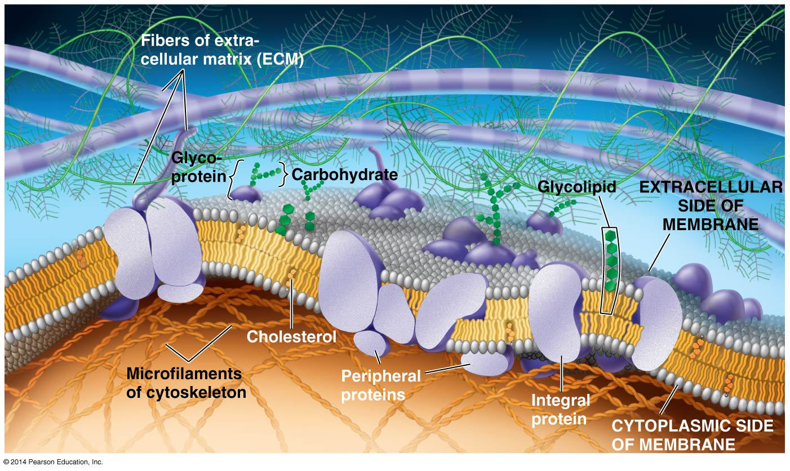
```

<div class="flex">
<div class="flex-text">
- Phospholipids:
    - Most abundant lipid in most membranes
    - **Amphipathic:** has both a hydrophilic region and a hydrophobic region. Bilayer arrangement shelters the hydrophobic tails while exposing the hydrophilic heads to water.
</div>
<div class="flex-img">
```{r phospholipid, echo = FALSE, out.height = "200px"}
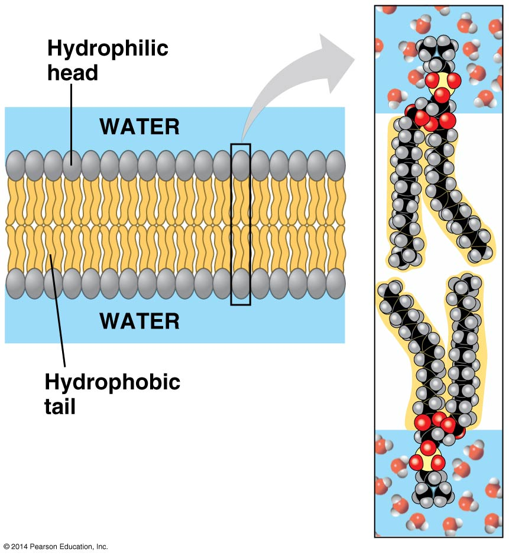
```
</div>
</div>

- Most membrane proteins are also amphipathic:
    - Can reside in the phospholipid bilayer with hydrophilic regions protruding
    - Provides its hydrophobic parts with a nonaqueous environment
- **Fluid mosaic model:** the membrane is a mosaic of protein molecules bobbing in a fluid phospholipid bilayer

#### The fluidity of membranes:
- Most lipids and some proteins can shift about laterally:
    - Proteins are much larger and move more slowly
    - Some proteins movie in a directed manner, others can be held in place
- As temperature decreases, phospholipids become closely packed and the membrane solidifies:
    - Unsaturated hydrocarbon tails cannot pack as closely as saturated tails, membrane remains fluid to a lower temperature
    - Cholesterol helps membranes resist changes in fluidity:
        - Restrains phospholipid movement at high temperatures
        - Hinders close packing at low temperatures
- Evolutionary differences in membrane lipid composition maintain appropriate fluidity under specific environmental conditions

#### Proteins determine membrane function:

```{r membproteins, echo = FALSE, out.height = "325px", fig.cap = "Proteins"}
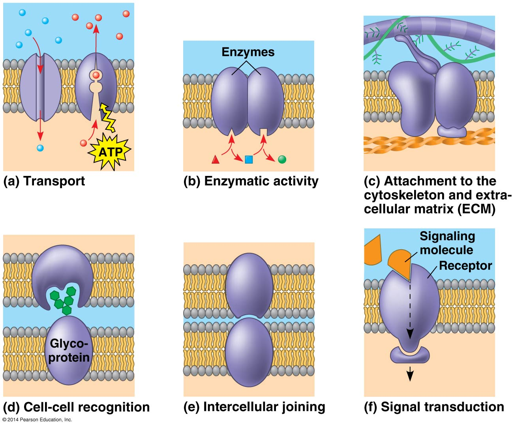
```

- **Integral proteins:** penetrate the hydrophobic hydrophobic interior of the lipid bilayer
    - Transmembrane proteins span the membrane, others extend only partway
    - Some proteins have hydrophilic channels that allow passage of substances ^[(a)](#fig:membproteins)^
- **Peripheral proteins:** not embedded in the lipid bilayer. Loosely bound to the surface of the membrane, often to exposed parts of integral proteins
- Some membrane proteins are attached to the cytoskeleton or to fibers of the ECM, providing a strong framework for animal cells ^[(c)](#fig:membproteins)^
- A single cell may have proteins carrying out several functions, and a single protein may have multiple functions

#### Membrane carbohydrates and cell-cell recognition:
- Cells recognize other cells by binding to molecules, often containing carbohydrates, on the surface of the plasma membrane ^[(d)](#fig:membproteins)^
- Membrane carbohydrates are usually short and branched:
    - **Glycolipids:** covalently bonded to lipids
    - **Glycoproteins:** covalently bonded to proteins
- Function as markers that distinguish one cell from another

#### Synthesis and sidedness of membranes:
- A membrane has two distinct faces
- Asymmetric arrangement of proteins, lipids, and attached carbohydrates is determined as the membrane is being built

```{r synthesis, echo = FALSE, out.height = "325px", fig.align = "center"}
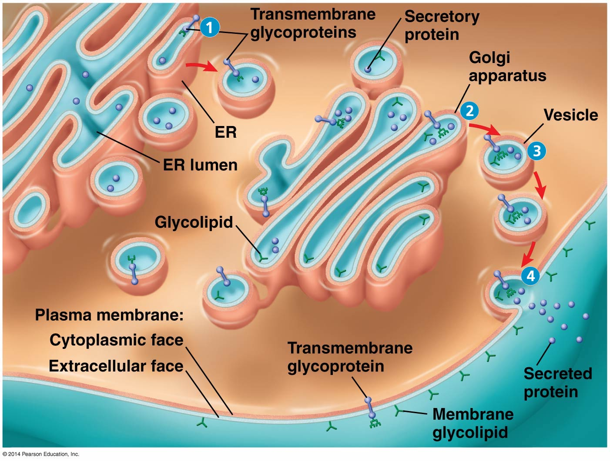
```

1. Membrane proteins and lipids are synthesized in the ER
2. Inside the Golgi apparatus, glycoproteins undergo carbohydrate modification, and some lipids become glycolipids
3. Synthesized membrane components are transported by vesicles
4. As vesicles fuse with the plasma membrane, the outside face of the vesicle become continuous with the cytoplasmic face of the plasma membrane. Carbohydrates are positioned on the extracellular face.

## **5.2** Membrane structure and permeability
- **Selectively permeable:** allows some substances to cross more easily than others
    - Nonpolar molecules (hydrophobic) can dissolve in the lipid bilayer and cross it easily
    - Ions and polar molecules (hydrophilic) are impeded by the hydrophobic interior of the membrane, do not cross very rapidly
    - Membrane proteins play key roles in regulating transport

#### Transport proteins:
- Allow hydrophilic substances to avoid contact with the lipid bilayer
- **Channel proteins:** provide a hydrophilic channel for certain molecules or ions to pass through
    - **Aquaporins:** channel protein that facilitates the passage of water molecules
- **Carrier proteins:** hold onto their passengers and change shape in a way that shuttles them across the membrane
- A transport protein is specific to the substance it moves

## **5.3** Passive transport
- Diffusion of a substance across a membrane with no energy investment
- **Diffusion:** the movement of a particles so that they tend to spread out evenly into the available space

    ```{r diffusion, echo = FALSE, out.height = "150px", fig.align = "center"}
    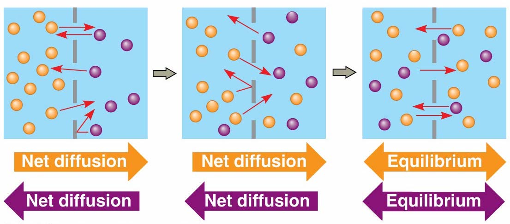
    ```

    - Results in dynamic equilibrium. Molecules continue to cross the membrane, but at equal rates in both directions.
    - A substance diffuses from where it is more concentrated to where it is less concentrated (down its **concentration gradient**)
    - Unaffected by the concentration gradients of other substances
    - No work must be done, concentration gradient represents potential energy and drives diffusion

#### Water balance:
- **Osmosis:** diffusion of water across a selectively permeable membrane
    - Some of the water is clustered around hydrophilic solute molecules and unable to cross the membrane
    - Water diffuses from the region of lower solute concentration (higher free water concentration) to that of higher solute concentration (lower free water concentration)
- **Tonicity:** the ability of a solution to cause a cell to gain or lose water
    - Depends on the solution's concentration of solutes that cannot cross the membrane

    ```{r osmosis, echo = FALSE, out.height = "225px", fig.align = "center"}
    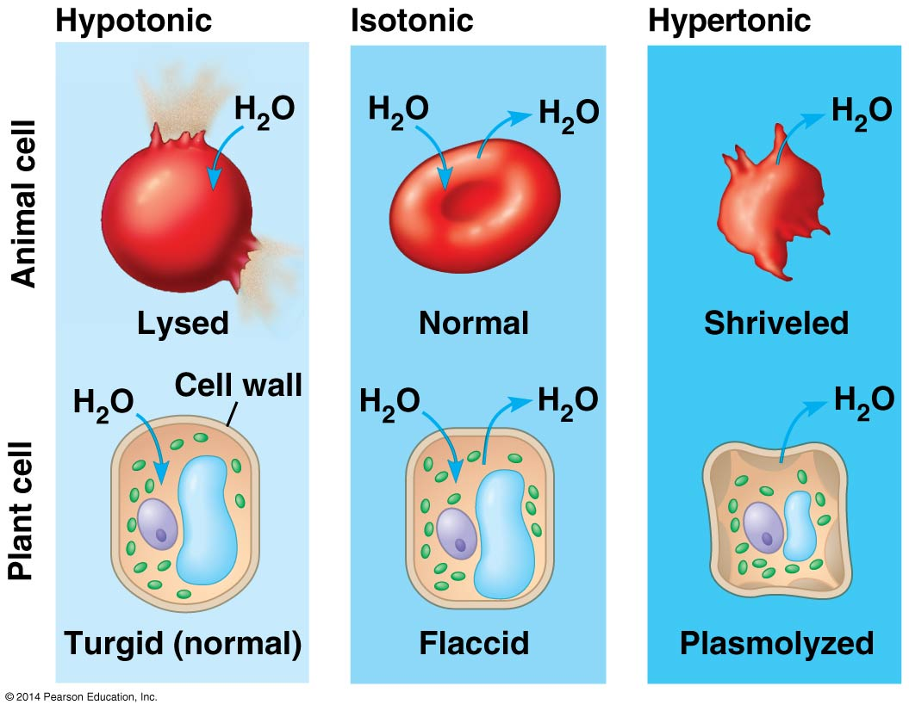
    ```

    - For cells without walls:
        - **Isotonic:** no net movement of water, volume of cell is stable (_iso_ "same")
        - **Hypertonic:** cell will lose water and shrivel (_hyper_ "more" nonpentrating solutes)
        - **Hypertonic:** water enters the cell faster than it leaves, cell will swell and lyse (_hypo_ "less")
        - **Osmoregulation:** the control of solute concentrations and water balance. A cell without rigid walls can tolerate neither excessive uptake nor excessive loss of water.
    - For cells with walls:
        - Hypotonic: cell swells as water enters, inelastic cell wall exerts a back pressure. Cell is **turgid** and healthy, provides mechanical support.
        - Isotonic: no net tendency for water to enter, cells become **flaccid**
        - Hypertonic: as cell shrinks, its plasma membrane pulls away from the wall (**plasmolysis**)

#### Facilitated diffusion:
- Passive transport aided by proteins
- **Ion channels:** channel protein that transports ions
    - **Gated channels:** open or close in response to a stimulus
- Carrier proteins may change shape in response to the binding and release of the transported molecule

## **5.4** Active transport
- Some transport proteins can move solutes against their concentration gradients
- Cells must expend energy, usually supplied by ATP
- Enables a cell to maintain internal concentrations of solutes that differ from concentrations in its environment
- **Sodium-potassium pump:**
    - An animal cell has a much higher concentration of potassium ions (K^+^) and a much lower concentration of sodium ions (Na^+^)

    <div class="flex">
    <div class="flex-text">
    - 3 Na^+^ are moved out for every 2 K^+^ pumped in
    - Pump oscillates between two shapes:
        - Protein shape in [(1)](#fig:nakpump) has a high affinity for Na^+^, shape in [(4)](#fig:nakpump) has a high affinity for K^+^
        - ATP powers the shape change by transferring a phosphate group (phosphorylation) ^[(2)](#fig:nakpump)^. Na^+^ binding stimulates phosphorylation, K^+^ binding triggers release of the phosphate group.
    </div>
    <div class="flex-img">
    ```{r nakpump, echo = FALSE, out.height = "400px", fig.cap = "NaKpump"}
    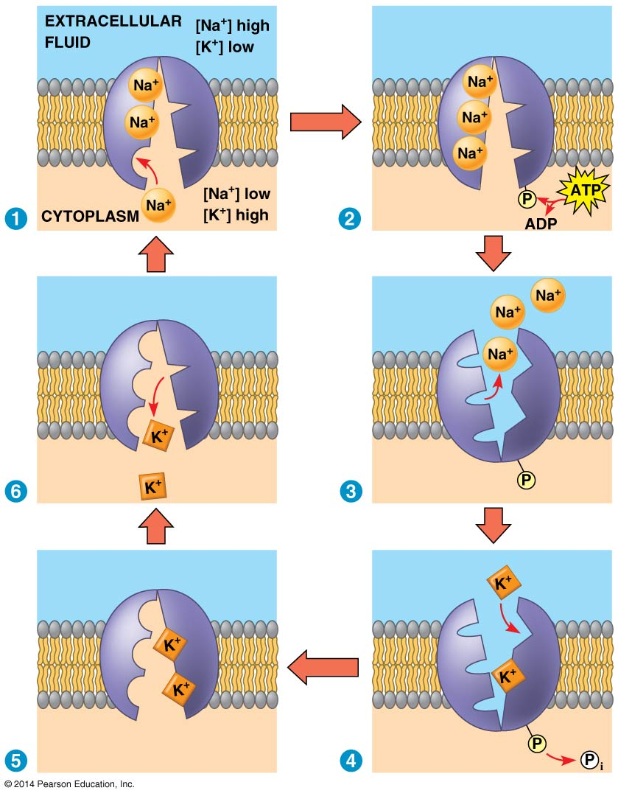
    ```
    </div>
    </div>

#### Ion pumps maintain membrane potential:
- Cytoplasmic side of the membrane is negative in charge relative to extracellular side
- Due to an unequal distribution of anions and cations on the two sides
- **Membrane potential** favors the passive transport of cations in the cell and anions out of the cell
- An ion diffuses down its **electrochemical gradient:**
    - Combination of a chemical force (concentration gradient) and an electric force
- **Electrogenic pump:** transport protein that generates a voltage across a membrane
    - Sodium-potassium pump is the major electrogenic pump fro animal cells (net transfer of one positive charge out of the cell)
    - Proton pumps in plants, fungi, and bacteria actively transport H^+^ out of the cell
    - Helps store energy that can be tapped for work

#### Cotransport:
- An ATP-powered pump can indirectly drive the active transport of other solutes:
    - A substance pumped across a membrane can do work as it moves back by diffusion
    - A cotransporter uses this to transport a second substance against its concentration gradient

<div class="flex">
<div class="flex-text">
 - In plants, the H^+^ gradient stores potential energy that can be used for active transport
    - Return of H^+^ coupled with the transport of sucrose
</div>
<div class="flex-img">
```{r cotransport, echo = FALSE, out.height = "200px"}
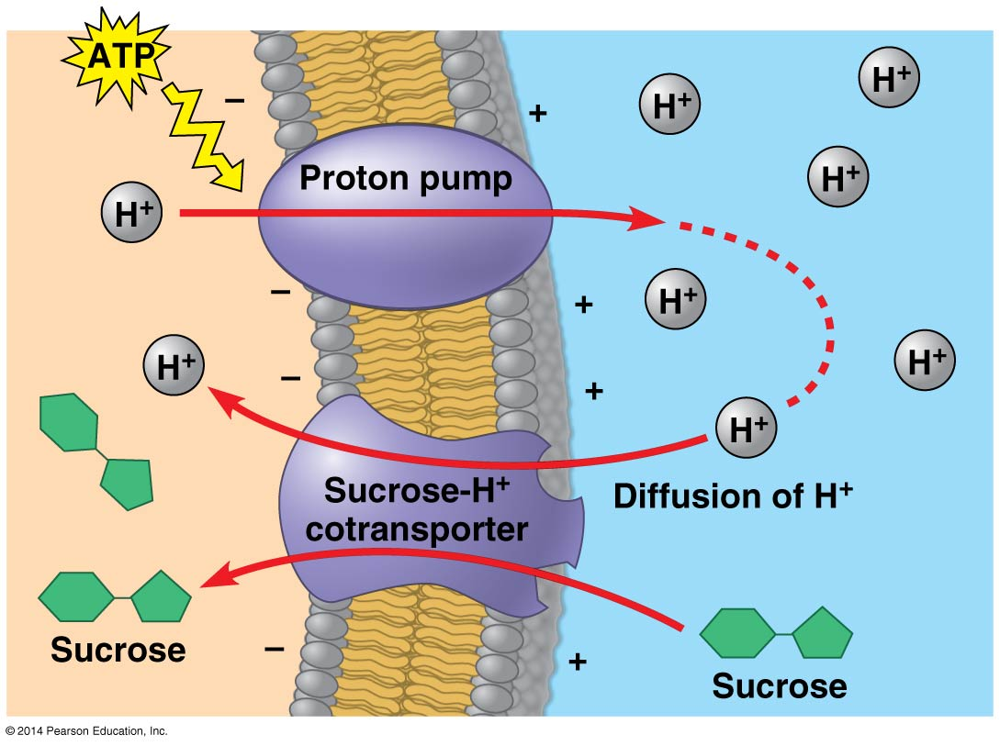
```
</div>
</div>

## **5.5** Bulk transport
- Large molecules cross the membrane by mechanisms that involve packaging in vesicles
- Requires energy

#### Exocytosis:
- Cells secrete biological molecules by the fusion of vesicles with the plasma membrane
    - Contents of the vesicle spill out, vesicle membrane becomes part of plasma membrane
- Used by many secretory cells

#### Endocytosis:
- Cells take in molecules by forming vesicles from the plasma membrane
    - Small area of the plasma membrane sinks inward to form a pocket
    - As the pocket deepens, it pinches in and forms a vesicles
- Events look like the reverse of exocytosis
- Three types:

    ```{r endocytosis, echo = FALSE, out.height = "300px", fig.align = "center"}
    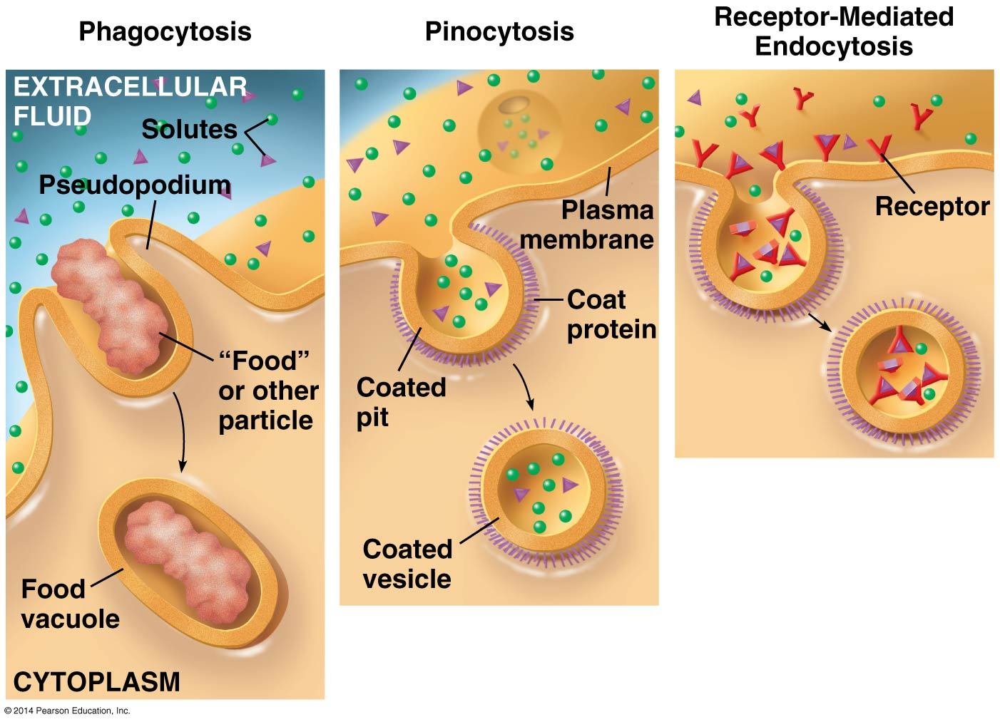
    ```

    - **Phagocytosis:** cell engulfs a particle by wrapping pseudopodia around it, "cellular eating"
    - **Pinocytosis:** cell continually gulps droplets of extracellular fluid, "cellular drinking"
        - Nonspecific for the substances it transports
        - Plasma membrane is coated on the cytoplasmic side with a fuzzy layer of proteins
    - **Receptor-mediated endocytosis:** specialized pinocytosis, specific solutes bind to embedded receptor sites
        - Relatively more bound molecules, but other molecules are also present
        - Receptor proteins are recycled to the plasma membrane by the same vesicle

## **5.6** Cell signaling

#### Local and long-distance signaling:
- Chemical messages sent out from cells are targeted to other cells that may not be immediately adjacent
- Cells may communicate through direct contact:
    - Cell junctions that directly connect the cytoplasms of adjacent cells
    - Direct contact between membrane-bound cell-surface molecules in cell-cell recognition
- In other cases, signaling cells secrete messenger molecules:
    - **Local regulators** travel only short distances ^[(a, b)](#fig:loclongsig)^
    - **Hormones** are used for long-distance signaling ^[(c)](#fig:loclongsig)^

    ```{r loclongsig, echo = FALSE, out.height = "275px", fig.cap = "Signaling"}
    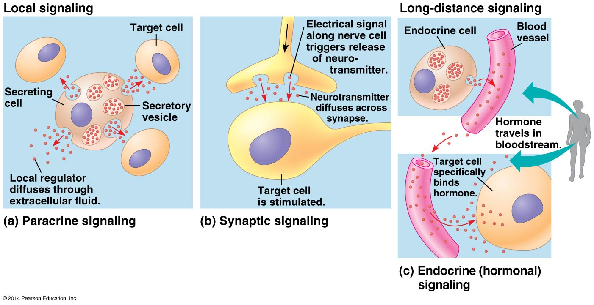
    ```

    a. **Paracrine signaling:** a secreting cell acts on nearby target cells by discharging local regulators into the extracellular fluid
    b. **Synaptic signaling:** a nerve cell releases neurotransmitter molecules into a synapse, stimulating the target cell. More specialized type of local signaling.
    c. **Endocrine** (hormonal) **signaling:** specialized endocrine cells secrete hormones into body fluids. Hormones reach all body cells, but are bound only by target cells.

#### The three stages of cell signaling:

```{r sigstages, echo = FALSE, out.height = "175px", fig.align = "center"}
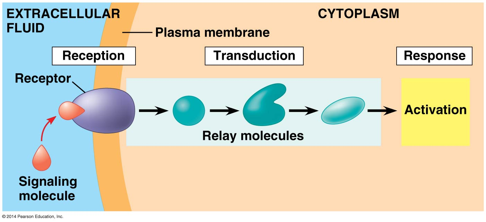
```

1. **Reception:** target cell's detection of a signaling molecule
    - Signaling molecule binds to a receptor protein located at the cell's surface or inside the cell
2. **Transduction:** steps that convert the signal to a form that can bring about a specific cellular response
    - **Signal transduction pathway:** a sequence of changes in a series of different relay molecules
3. Transduced signal triggers a **response**

#### Reception:
- Signaling molecule behaves as a **ligand**, a molecule that specifically binds to another molecule
    - Ligand binding causes a receptor protein to undergo a change in shape, directly activating the receptor
    - Most signal receptors are plasma membrane proteins with water-soluble ligands <a class="footref">^&dagger;^</a><span class="footbody">**Receptor tyrosine kinases** are discussed in the unabridged textbook and in class, may appear on the AP test</span>
- **G protein-coupled receptor** (GPCR)**:**
    - **G protein:** binds the energy-rich molecule GTP
    
    <div class="flex">
    <div class="flex-text">
    1. Signaling molecule binds to the extracellular side of the receptor. Activated receptor binds and activates a G protein.
    2. Activated G protein (carrying GTP) leaves the receptor and binds to an enzyme, altering its shape. Activated enzyme triggers the next step leading to a cellular response.
    </div>
    <div class="flex-img">
    ```{r gpcr, echo = FALSE, out.height = "250px"}
    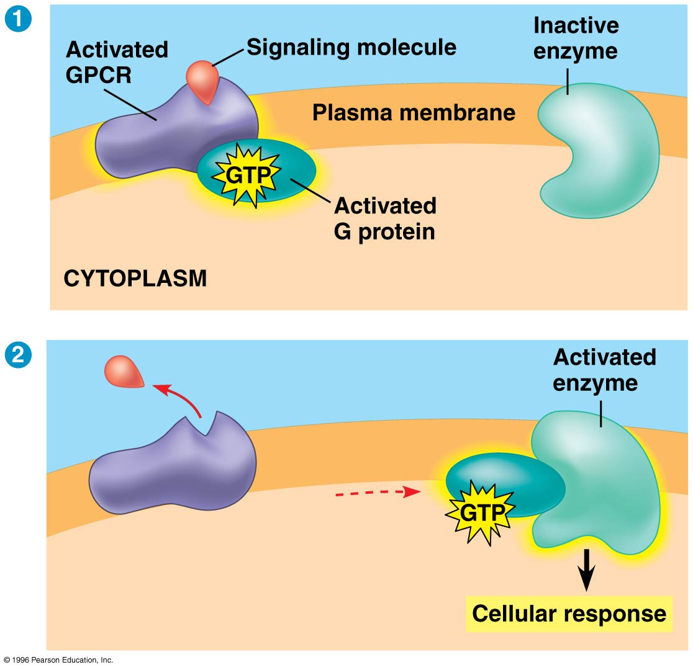
    ```
    </div>
    </div>

    - Binding and changes in shape are temporary, molecules soon become available for reuse
        - G protein hydrolyzes GTP to GDP and a phosphate ion
        - Inactive G protein leaves the enzyme, which returns to its original state
    - Many signaling molecules use GPCRs, all GPCRs are remarkably similar in structure
- **Ligand-gated ion channel:** membrane receptor with a region that acts as a gate when a certain shape is assumed

    ```{r lgion, echo = FALSE, out.height = "250px", fig.align = "center"}
    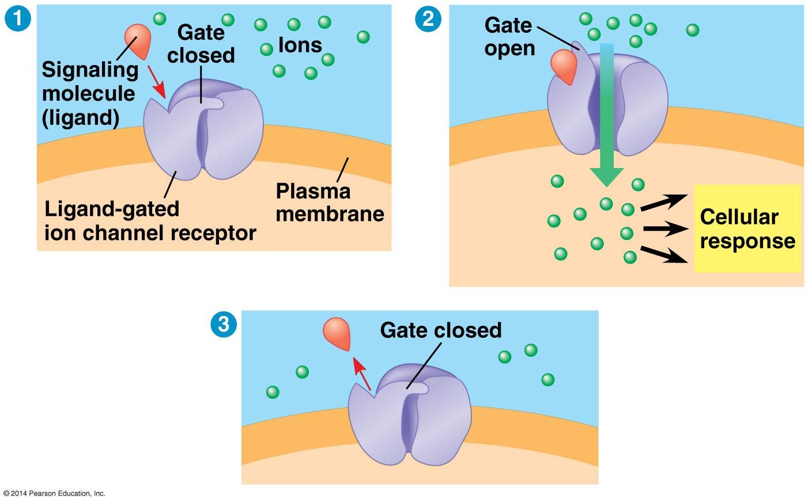
    ```

    - Gate opens or closes when a signaling molecule binds as a ligand on the extracellular side
    - Allows or blocks the diffusion of specific ions through a channel in the protein
    - Important in the nervous system, neurotransmitter molecules released at a synapse bind to ion channels on the receiving cell

<div class="flex">
<div class="flex-text">
- Intracellular receptors:
    - Found in either the cytoplasm or nucleus of target cells
    - Signaling molecule must be hydrophobic enough to cross the membrane
    - Testosterone: representative of steroid hormones
        - Secreted by the testes and travels through the blood, entering cells all over the body. Only cells with receptors for testosterone respond
        - Hormone-receptor complex enters the nucleus and turns on specific genes
        - Receptor itself carries out the complete transduction of the signal
</div>
<div class="flex-img">
```{r steroidhormone, echo = FALSE, out.height = "350px"}
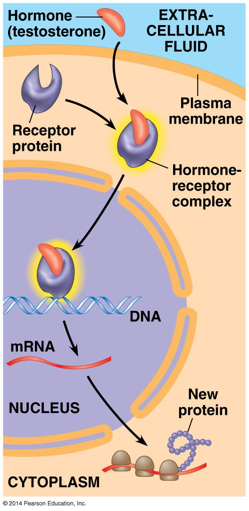
```
</div>
</div>

#### Transduction:
- Usually a multistep pathway, provides more coordination and the possibility of greatly amplifying a signal
- Signal-activated receptor activates another molecule, which activates another molecule, and so on
- Continues until the protein that produces the final cellular response is activated
- Original signaling molecule is not passed along. The signal is transduced into different forms, commonly via a shape change in a protein.
- Protein phosphorylation:

    ``` {r phoscascade, echo = FALSE, out.height = "325px", fig.align = "center"}
    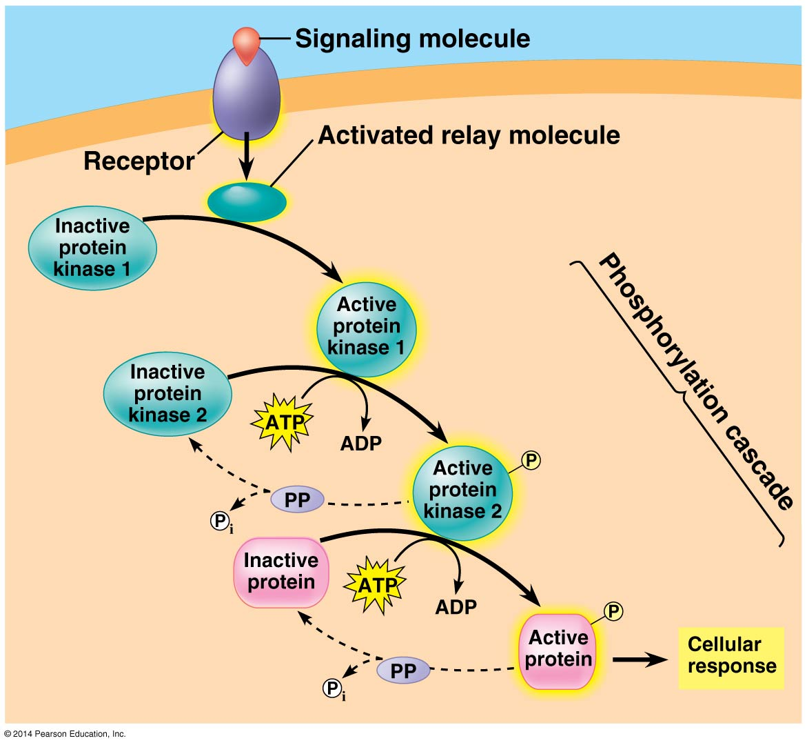
    ```

    - **Protein kinase:** enzyme that transfers phosphate groups from ATP to a protein. Many relay molecules are protein kinases.
    - Phosphorylation cascade: a series of molecules in a pathway are phosphorylated in turn
    - **Protein phosphatase:** enzyme that removes phosphate groups, dephosphorylation
        - Turns off signal transduction pathway when the initial signal is no longer present
        - Make protein kinases available for reuse
    - Phosphorylation-dephosphorylation acts as a molecular switch, turning an activity on or off as required
- Small molecules and ions as **second messengers:**
    - Small, nonprotein, and water-soluble, can spread readily throught the cell by diffusion
    - Two most common second messengers are **cyclic AMP** (cAMP) and Ca^2+^

    <div class="flex">
    <div class="flex-text">
    - G protein signaling pathway with cAMP:
        - First messenger (signaling molecule) activates a GPCR
        - G protein activates adenlyl cyclase, which catalyzes the conversion of ATP to cAMP
        - cAMP activates another protein, usually protein kinase A, leading to cellular responses
    </div>
    <div class="flex-img">
    ``` {r gpcrcamp, echo = FALSE, out.height = "275px"}
    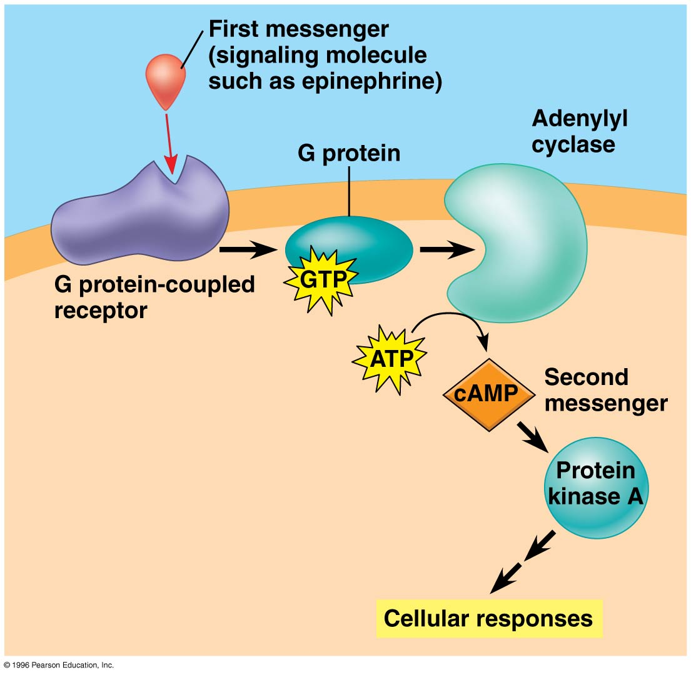
    ```
    </div>
    </div>

#### Response:
- Regulation of one or more cellular activities
- Final activated molecule may function as a transcription factor, ultimately regulating protein synthesis
- Pathway may regulate the activity of a protein (epinephrine activates enzymes that catalyze the breakdown of glycogen)

<script src="js/footnotes.js"></script>
